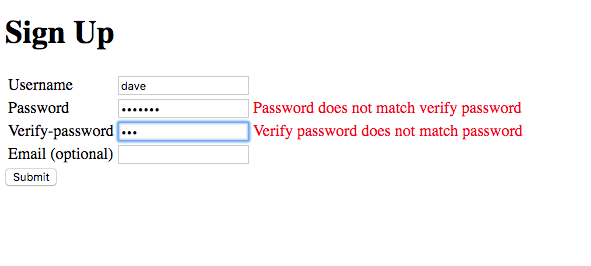

# user-signup

This is a user signup form with required fields username, password and verify-password fields.  If any of the required fields are blank or if the passwords do not match, the form is returned with error messages.  Otherwise, the user is redirected to a welcome page.

## Password Verification Error

## User Signup

## Welcome Screen

